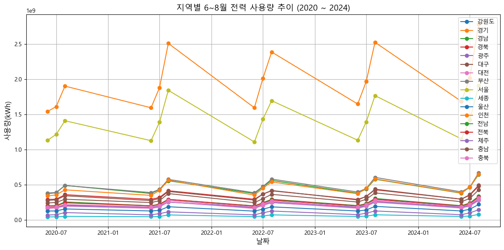

**SK네트웍스 Family AI 캠프 17기 Machine Learning 미니 프로젝트**

---

# 팀 소개

### ✨4조 Dataforce✨

👥 팀 멤버 (개인 GitHub)

| 이름  | GitHub 계정                                    |
| ----- | ---------------------------------------------- |
| 이가은 | [@Leegaeune](https://github.com/Leegaeune)    |
| 이민영 | [@mylee99125](https://github.com/mylee99125) |
| 조해리 | [@Haer111](https://github.com/Haer111)     |
| 주수빈 | [@Subin-Ju](https://github.com/Subin-Ju) |

---

## 💡프로젝트 명

### 지역별 날씨 데이터 기반 냉방 전력 사용량 예측

## ❓프로젝트 소개
['에어컨 끌 수가 없어요'…때이른 폭염에 전력 수급 총력전](https://www.hankyung.com/article/202507100041i)  
날이 갈수록, 해가 지날수록 우리나라의 평균 기온과 최고 기온, 최저 기온은 상승하며, 점차 그 예측 속도와 범위를 벗어나고 있는 상황이다. 이러한 상황 속에서 때이른 폭염과 길어지는 여름철 날씨는 냉방 가동을 가속화시켜 여름철 전력 수급에 큰 어려움을 겪게 한다. 따라서 지역별 여름철 날씨 데이터와 전국 전력 사용량 데이터를 활용해 전력 사용량 추이를 분석하고, 여름철 전력 사용량을 예측할 수 있는 모델을 만들어 여름철 전력 수급에 있어 도움을 주고자 한다. 

---

## ✅ 데이터 출처 목록

| 데이터 이름                           | 파일 형식 / 수집 방법 | 출처 URL |
|--------------------------------------|------------------------|----------|
| 기상자료개방포털 - 종관기상관측(ASOS) - 자료      |  CSV  / 직접 다운로드  | [바로가기](https://data.kma.go.kr/data/grnd/selectAsosRltmList.do?pgmNo=36) |
| 전력데이터 개방 포털 시스템 - 주택용 전력 데이터 - 자료      | CSV / 크롤링 통한 다운로드  | [원본 데이터](https://bigdata.kepco.co.kr/cmsmain.do?scode=S01&pcode=000166&pstate=L&redirect=Y)|

---

# 🛠️ 기술 스택

| 활용 용도             | 사용한 기술 스택             |
|-----------------------|--------------------------------------|
| 코드 작성              |   |
| 군집화                 |  |
| 시각화                 |  |
| 파일 공유 및 커뮤니케이션| |
  
---

# 🖥️ 데이터 전처리 과정
* **전기 데이터 크롤링 및 컬럼명 처리**
    * `행정구역별` 선택 → `주택용` 체크박스만 선택
    * 시도 목록 불러오기 → 전체 시도 제외, `실제 시도`만 선택
    * `전체` 지역 + `주택용` 계약만 필터링
    * 결과 CSV 파일로 저장
    * CSV 파일 속 시도 코드 - 시도명 매핑 → 저장된 CSV 파일에 `시도명` 컬럼 추가

* **날씨 데이터 csv 파일 로드 및 컬럼명 처리**
    * 최근 5년(2020~2024)의 기상 데이터를 `pandas`를 사용하여 불러옴.
    * `일시`, `평균기온(°C)` 등 원본 컬럼명을 `날짜`, `평균기온` 등으로 일관되게 변경

* **날씨 데이터 형식 변환 및 결측치 처리**
    * `날짜` 컬럼은 `datetime` 형식으로 시간 기반 분석이 가능하도록 변환
    * `평균 기온`, `최고 기온`, `습도` 컬럼은 `to_numeric` 코드를 통해 숫자형 데이터로 변환

* **지역 재그룹핑**
    * 기상 데이터 관측의 기준이 되는 지점이 `시/도` 구분이 아닌 다른 기준으로 세분화 되어 있었음.
    * 세분화된 지점을 `지역`('강원도', '경기', '경남', '경북','광역시 및 특별시', '전남', '전북', 제주', '충남', '충북')으로 재그룹핑.
    * `지역` 컬럼 추가
    * 이후 관측 기준이 되는 지점과 지점명을 (`.drop()`) 코드를 통해 삭제 → '지역' 컬럼을 맨 앞으로 분류
 
* **필요 연월만 남기기**
    * `날짜` 컬럼에서 `연도`와 `월` 분리
    * 분리 후 필요한 달 (6, 7, 8월) 데이터만 추출

* **전기 데이터 + 날씨 데이터 병합**
    * 전기 데이터 속 `지역 코드`와 날씨 데이터 속 `시도명` 매핑
    * `merge` 통해 두 데이터 프레임 병합

---

# 📑 지역별 여름철 전력 사용량 추이 분석

* **추이 분석**
    * 여름철 6, 7, 8월 중 가장 전력 사용량이 많은 달 → 8월
    * 눈에 띠는 시기 : 2021년. 그러나 전반적으로 2020 → 2024로 갈수록 전력 사용량은 상승 추세
    * 전력 사용량 가장 많은 도시들 : 경기, 서울 → 인구 수의 영향이 있을 것으로 추정
    * 전력 사용량에 영향을 미치는 요인들 : 평균 기온, 최고 기온, 최저 기온, 습도, 전력 평균 단가(예 : 서울 < 전북)

---
# 전기 사용량 예측
* **학습 과정**
    * 사용할 변수 선택 : 평균 기온, 최고 기온, 습도
    * 결측치 처리 : feature에 해당하는 컬럼에 결측치 → `.mean`을 통해 각 열의 평균으로 채움
    * 학습 / 테스트 데이터 분할
    * 모델 리스트 정의 : `LinearRegression`, `RandomForest`, `XGBoost` 활용

* **최종 예측 모델 학습 및 평가**
    * 사용할 feature과 target 지정:
      * 수치형 특성 : 평균 기온, 최고 기온, 습도, 월, 연도 / target : 전력 사용량(kWh)
    * 지역 변수 One-Hot Encoding:
      * 범주형 변수 `지역`을 0 or 1로 나누는 One-Hot Encoding 적용 → 새로운 컬럼 생성
    * 사용할 최종 feature 정리:
      * 최종 feature : 수치형 특성 + One-Hot 인코딩 한 지역 컬럼들
    * X, y 데이터셋 생성:
      * X 데이터 : 최종 feature / y 데이터 : target(전력 사용량)
    * PolynomialFeatures를 통한 다항 특성 생성:
      * 수치형 특성들 → 2차항(polynomial_degree=2)으로 확장
      * 다항 확장된 수치형 특성 + 지역 컬럼들 => X_final 데이터로 최종 활용
    * 모델 학습 및 성능 평가
      * 학습/테스트 데이터 분할(학습:테스트 = 8:2)
      * 스케일링 : StandardScaler를 통한 정규화 진행
      * 최종 모델 : Linear Regression(선형 회귀)
      * 성능 평가 : R²(R2 score) → 1에 가까울수록 성능이 좋음.
        | 모델명           | R2   |
        |-----------------|-------|
        |Linear Regression| 0.97057| 

.png)

    

---
# 🪄 성능 향상을 위한 과정
* **초기 모델 선정 및 성능 평가**
    * 평가 지표 : MAE(Mean Absolute Error), RMSE(Root Mean Squared Error), R²(R2 score)
    * 변수 중요도 시각화 과정
      | 모델명            | MAE            | RMSE           | R2         |
      |------------------|----------------|----------------|------------|
      |Linear Regression| 2.001161e+08 | 3.718493e+08 | -0.011490 |
      |Random Forest    | 2.390083e+08 | 4.274007e+08 | -0.336282 |
      |XGBoost         | 2.548086e+08 | 4.634841e+08 | -0.571439 |
.png)
.png) 

* 특성 중요도 : 평균 기온이 예측에 가장 큰 영향을, 습도가 상대적으로 적은 영향을 줌.
* 그러나 각 모델의 R2 score가 지나치게 낮고 유의미하지 않음 → 변수 확장, target 데이터 이상치 분석 등 데이터 추가 분석 및 처리 필요

* **이상치 확인 및 처리**
    * 이상치 처리 기준 : IQR(사분위수)
      * 하위 이상치 경계 : Q1 - 1.5 × IQR
      * 상위 이상치 경계 : Q3 + 1.5 × IQR
    * 데이터셋에서 이상치 제거 : 하위 이상치 경계 이하 or 상위 이상치 경계 이상인 데이터들
    * X(feature)와 y(target) 데이터 → 이상치 정제된 데이터로 재할당

* **정제 데이터를 활용한 모델 성능 재평가**
    * 데이터 스케일링 : StandardScaler
    * 최초 학습과 동일한 모델 및 성능 평가 지표 활용
    * 성능 평가 결과:
      | 모델명            | MAE            | RMSE           | R2         |
      |------------------|----------------|----------------|------------|
      |Linear Regression| 8.119515e+07 | 9.974439e+07 | 0.149313 |
      |Random Forest    |  8.320449e+07 | 1.046873e+08 | 0.062911 |
      |XGBoost         | 9.217372e+07 | 1.174477e+08 | -0.179457 |

.png)

* R2 score 측면에서는 최초 학습 모델보다 향상된 성능을 보임.
* 그러나 R2 score에서 가장 높은 점수였던 선형회귀 모델보다 결정트리 모델이 시각화 시 안정적인 모습.
* 결정트리 모델 또한 여전히 빨간 중심 선에서 데이터가 많이 흩어진 모습
=> 성능을 향상시키기 위한 전략 : 최종 모델에서 활용한 `PolynomialFeatures`를 통한 다항 확장

---
# 프로젝트 기대 효과
1. 높은 R2 score로 성능 평가를 통과한 예측 모델 → 보다 정확한 전력 사용량 예측을 통한 비용 절감
2. 정확한 전력 사용량 예측 → 여름철 전력 수급 부족 문제를 대응하기 용이. (필요한 전력량을 사전에 파악하고 대처 가능)
3. 여름철 전력 수급 부족 문제 사전적 대응 가능 → 지역별로 남는 잉여 전력을 전력 사용량이 많은 지역으로 재분배 → 효율적인 전력 운영 가능 

---
# 한 줄 회고
* 이가은 :
* 이민영 :
* 조해리 : 지역별 날씨 데이터를 클러스터링했을 때, 초기 실루엣계수가 0.2로 나와 꽤 충격을 받았다. 이후 파생변수를 추가하고, 차원축소나 모델 변경 등 여러 방법을 시도했지만 최대 0.4까지밖에 끌어올리지 못했다. 비록 결과적으로 발표에 포함되지는 않았지만, 시각화를 통해 계수가 오를수록 군집 구조가 달라지는 모습을 보며 성능 향상의 중요성과 다양한 시도의 필요성을 다시 한 번 느낄 수 있었다.
* 주수빈 : 리드미를 본격적으로 맡아 작성한 프로젝트는 처음인데, 리드미 백업이 정말 중요하다는 것을 몸소 느꼈다.. 또한 지역별 날씨 데이터 클러스터링에서 0.2로 나온 실루엣 계수를 높이기 위해 컬럼을 추가해 보았으나 되려 계수값이 떨어지는 이상한 현상을 목격하기도 했다. 이후 PCA를 통한 차원 축소를 진행하자 그나마 0.4 정도로 오르는 것을 보고 실루엣 계수 향상이 참 어렵다고 느끼는 한편, 차원 축소를 통한 분류 정확도 상승을 직접 경험할 수 있었다.

