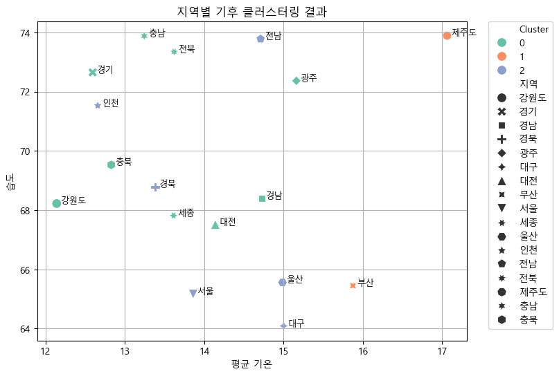

**SK네트웍스 Family AI 캠프 17기 Machine Learning 미니 프로젝트**

---

# 팀 소개

### ✨4조 Dataforce✨

👥 팀 멤버 (개인 GitHub)

| 이름  | GitHub 계정                                    |
| ----- | ---------------------------------------------- |
| 이가은 | [@Leegaeune](https://github.com/Leegaeune)    |
| 이민영 | [@mylee99125](https://github.com/mylee99125) |
| 조해리 | [@Haer111](https://github.com/Haer111)     |
| 주수빈 | [@Subin-Ju](https://github.com/Subin-Ju) |

---

## 💡프로젝트 명

### 지역별 기후 패턴 분류 및 기온 예측

## ❓프로젝트 소개

---

## ✅ 데이터 출처 목록

| 데이터 이름                           | 파일 형식 / 수집 방법 | 출처 URL |
|--------------------------------------|------------------------|----------|
| 종관기상관측(ASOS) - 자료      |  CSV  / 직접 다운로드  | [바로가기](https://data.kma.go.kr/data/grnd/selectAsosRltmList.do?pgmNo=36) |

---

# 🛠️ 기술 스택]

| 활용 용도             | 사용한 기술 스택             |
|-----------------------|--------------------------------------|
| 코드 작성              |   |
| 군집화                 |  |
| 시각화                 |  |
| 파일 공유 및 커뮤니케이션| |
  
---

# 🖥️ 데이터 전처리 과정
* **csv 파일 로드 및 컬럼명 처리**
    * 최근 10년(2015~1014)의 기상 데이터를 'pandas'를 사용하여 불러옴.
    * `일시`, `평균기온(°C)` 등 원본 컬럼명을 `날짜`, `평균기온` 등으로 일관되게 변경

* **형식 변환 및 결측치 처리**
    * `날짜` 컬럼은 `datetime` 형식으로 시간 기반 분석이 가능하도록 변환
    * `강수량`과 `적설량` 컬럼은 결측치(NaN 또는 공백) (`.fillna()`)를 통해 `0.0`으로 채워줌.

* **지역 재그룹핑**
    * 기상 데이터 관측의 기준이 되는 지점이 `시/도` 구분이 아닌 다른 기준으로 세분화 되어 있었음.
    * 세분화된 지점을 `지역`('강원도', '경기', '경남', '경북', '광주', '부산', 세종', '인천', '전남', '전북', 제주', '충남', '충북') 기준으로 재그룹핑.
    * `지역` 컬럼 추가
    * 이후 관측 기준이 되는 지점과 지점명을 (`.drop()`) 코드를 통해 삭제 → '지역' 컬럼을 맨 앞으로 분류

---

# 📑 지역별 기후 패턴 분류
## 1. 지역별 기후 클러스터링
* **클러스터링 과정**
    1. 지역 + 연도별 평균 집계: `agg_features`로 특징 잡기 → `지역`으로 `.groupby` 진행 → `.mean`으로 평균 기온/최저 기온/최고 기온/강수량/풍속/습도/적설량 평균치 계산
    2. 정규화 : `StandardScaling`
    3. 군집 모델 학습: `KMeans`를 활용하여 3개의 클러스터(`n_cluster=3`)로 분류 → 학습 진행
    4. 시각화

* **클러스터링 분류 결과**
     * cluster 0 (주황색): 평균 기온이 가장 높고, 습도는 중간 수준 → 한국에서 기온이 가장 높고 특이한 기후를 가진 지역
     * cluster 1 (연두색): 기온 중상~중간, 습도는 낮은 수준 → 상대적으로 따뜻하고 건조한 특성을 가진 지역
     * cluster 2 (파란색): 평균 기온 낮고, 습도는 높은 수준 → 서늘하고 습한 지역

## 2. 군집 기반 지역 분류
* **군집화 과정**
    1. `.groupby`: [`지역`, `연도`]로 묶어 평균 기온/습도/풍속 등 집계
    2. 피처 선택 및 정규화: `지역` 기준으로 평균 기온/습도/풍속 그룹화 → `.mean` 이후 `StandardScaler` 활용
    3. `KMeans`: 지역 군집화

* **군집 기반 지역 분류 결과**
     * cluster 0 (초록색): 평균 기온/습도가 중간 정도인 지역 → 기후적으로 가장 '평범한' 지역들
     * cluster 1 (주황색): 낮은 평균 기온 / 높은 습도인 지역 → 기후적으로 '서늘하고 습한' 지역들
     * cluster 2 (파란색): 높은 평균 기온 / 낮은 습도인 지역 → 기후적으로 '더운/건조한' 지역들

---
# 📡 기온 예측

---
# 🪄 성능 향상을 위한 시도

